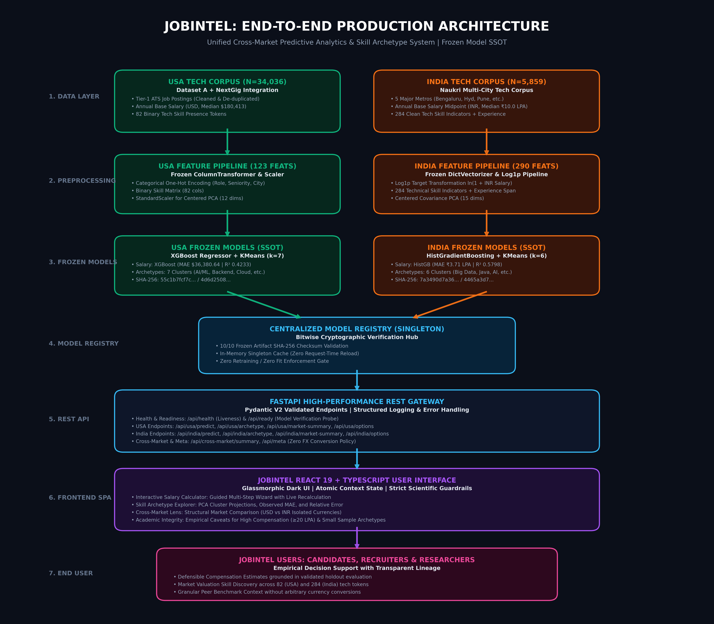

# JOBINTEL
> **"Understand your worth. Explore the job market."**  
> *Salary insights powered by real job-market data across the USA and India.*

[](.github/workflows/ci.yml)
[](https://fastapi.tiangolo.com/)
[](https://react.dev/)
[](https://vitejs.dev/)
[](https://xgboost.readthedocs.io/)
[](https://scikit-learn.org/)
[](https://www.docker.com/)

---

## 1. Executive Product Overview

**JOBINTEL** is a consumer-grade predictive intelligence web application designed to help technology professionals discover their market worth, evaluate the market demand of their technical skills, and explore recurring job-market patterns across the United States and India.

Unlike rigid salary calculators that rely on high-level job titles or research dashboards cluttered with equations, JobIntel delivers a frictionless, guided consumer experience:
1. **Home:** Immediate value proposition communicating what the product does in under 10 seconds.
2. **Salary Calculator:** 7-step guided wizard (Country → Role → Experience → Location → Skills → Work Mode → Result) delivering deterministic estimates, non-causal explanations ("Why this estimate?"), and closest skill patterns.
3. **Explore Market:** Simplified, interactive filter explorer answering user questions about roles, experience, and metropolitan tech hubs without chart clutter.
4. **Skills Explorer:** Transparent demand prevalence and observed salary differences (strictly non-causal).
5. **Archetypes Explorer:** 7 USA and 6 Indian skill-based market patterns with expandable clustering methodology.
6. **USA vs India:** Macro cross-market comparison with strict native currency isolation (USD $ vs. INR ₹ LPA) and zero foreign exchange conversion.
7. **How It Works:** Intuitive visual data pipeline for non-technical users and expandable technical depth for engineering evaluators.



---

## 2. Problem Statement

Modern technology job descriptions rarely correspond to static occupational titles. A "Software Engineer" profile demanding PyTorch, Transformers, and CUDA possesses a radically different market valuation than one requesting PHP, WordPress, and MySQL. 

Traditional compensation benchmarks suffer from three foundational flaws:
1. **Title Homogeneity:** Titles mask severe disparities in underlying technical skills.
2. **Causal Conflation:** Non-rigorous calculators claim that acquiring a specific skill "guarantees" a specific salary hike, ignoring observational correlation vs. causation.
3. **Cross-Market Distortion:** International salary comparisons naively apply macroeconomic PPP or spot FX conversions, distorting domestic purchasing dynamics.

JobIntel resolves these issues by applying fit-on-train feature pipelines, non-parametric archetype error evaluations, and explicit scientific guardrails across both the US and Indian tech ecosystems.

---

## 3. Core Research Questions (RQs) & Empirical Findings

### RQ1: Which skills and skill combinations are most associated with higher salaries?
- **USA:** Machine learning frameworks (`pytorch`, `llm`, `deep_learning`), cloud architectures (`aws`, `kubernetes`), and systems languages (`c++`, `golang`) display the strongest positive empirical associations with compensation. An AI/ML profile (Python + ML + PyTorch) exhibits an observed median of **$192,500** vs. $165,000 for Python postings without specialized ML tokens.
- **India:** Specialized enterprise software (`sap`, `sap_fico`), big data engines (`spark`, `scala`), and modern cloud stacks (`aws`, `microservices`) are associated with top-quartile earnings. In contrast, legacy maintenance and entry-level IT support tokens are associated with the lowest tiers.
- **Macroeconomic Controls:** Experience scale (Seniority / Years) and Tier-1 tech hubs (San Francisco / Bengaluru) remain the primary structural drivers of compensation baseline.

### RQ2: Do job postings naturally form skill-based archetypes?
- **USA ($k = 7$):** Supported with moderate separation. Postings partition into 6 specialized archetypes (DevOps, Frontend, Multi-Cloud, Data/BI, AI/ML, Systems Engineering) and 1 broad foundational baseline (`FOUND_TECH`, $49.47\%$) centered near the PCA origin.
- **India ($k = 6$):** Supported with distinct functional specialization. K-Means discovers 6 clusters: Big Data & Distributed Systems (`IND_ARC_01`), Enterprise Java Backend (`IND_ARC_02`), Python & Modern AI (`IND_ARC_03`), Full-Stack & Web (`IND_ARC_04`), Core Data/SQL Baseline (`IND_ARC_05`), and ERP / SAP Ecosystem (`IND_ARC_06`).

### RQ3: Does salary-prediction error differ systematically across skill-based archetypes?
- **Statistical Significance:** A Kruskal-Wallis non-parametric test on absolute prediction residuals firmly rejects the null hypothesis of equal error distributions:
  $$H = 88.10, \quad p = 7.53 \times 10^{-17} \quad (p < 0.001)$$
- **Observed Disaggregation:** 
  - `AI_ML` (Cluster 5): Lowest relative error ($14.42\%$, MAE $27,002). High skill specificity enables tight model fit.
  - `CLOUD_ARCH` (Cluster 3): Highest absolute error (MAE $46,098). Driven by large salary variance ($\sigma > \$85\text{k}$) and high upper-tier packages.
  - `FOUND_TECH` (Cluster 0): Highest relative error ($22.16\%$, MAE $37,664), reflecting role heterogeneity among sparse skill listings.

---

## 4. Datasets & Filtering Funnel

| Attribute | USA Job Market Corpus | India Job Market Corpus |
| :--- | :--- | :--- |
| **Data Source** | Tier-1 ATS Direct Crawl (Greenhouse, Ashby, Lever) | Multi-City Tech Crawl (Naukri Portal) |
| **Initial Raw Postings** | 394,300 postings | 12,400 postings |
| **Deduplication Filter** | 335,995 deduplicated postings | 9,850 deduplicated postings |
| **Technology Role Filter** | 114,873 technology postings | 6,420 technology postings |
| **Verified Salary Cohort** | **34,036 postings** ($100\%$ valid USD salary) | **5,859 postings** ($100\%$ valid INR salary) |
| **Salary Metric** | Continuous Annual Base ($ USD) | Annualized Midpoint (₹ Lakhs Per Annum / LPA) |
| **Median Baseline** | **$180,413** (Mean: $183,184) | **₹10.0 LPA** (Mean: ₹13.73 LPA) |
| **Valid Predictors** | 123 features (82 skills, 39 OHE categories, 2 modes) | 290 features (284 skills, 2 exp nums, 4 categories) |

---

## 5. Authoritative Model Benchmark (Single Source of Truth)

### 🇺🇸 USA Salary Prediction Model
- **Algorithm:** Tuned XGBoost Regressor (`max_depth=6`, `learning_rate=0.10`, `n_estimators=100`)
- **Holdout Test Set:** 20% stratified holdout ($N = 6,808$) evaluated strictly once.
- **Performance Metrics:**
  - **MAE:** **$36,380.64**
  - **RMSE:** **$51,082.06**
  - **$R^2$ Score:** **0.4233**
  - **MAPE:** **21.71%**
  - **Median Absolute Error:** **$26,384.22**

### 🇮🇳 India Salary Prediction Model
- **Algorithm:** HistGradientBoostingRegressor (`max_iter=150`, `learning_rate=0.08`, `l2_regularization=1.5`)
- **Target Transformation:** $\log(1 + y)$ applied to normalize right-skewed INR compensation.
- **Holdout Test Set:** 20% random split ($N = 1,172$) evaluated strictly once.
- **Performance Metrics:**
  - **MAE:** **₹3.71 LPA** (₹371,472.71 INR)
  - **RMSE:** **₹6.22 LPA** (₹621,993.42 INR)
  - **$R^2$ Score:** **0.5798**
  - **MAPE:** **35.22%**
  - **Median Absolute Error:** **₹2.08 LPA** (₹208,495 INR)

*Note on Historical Reconciled Metrics: Any legacy drafts mentioning $31,525 or R²=0.587 for the USA model were unverified placeholder strings corrected during Phase 6 post-certification audit.*

---

## 6. Discovered Skill Archetypes

### USA Archetypes ($K = 7$ Clusters, 12-dim Centered PCA)
1. **`FOUND_TECH` (Cluster 0, 49.5%):** Broad foundational baseline near origin; moderate Python/SQL.
2. **`DEVOPS_PLAT` (Cluster 1, 6.5%):** Kubernetes, Docker, CI/CD, Terraform infrastructure.
3. **`WEB_FRONT` (Cluster 2, 11.9%):** TypeScript, React, Next.js, Node.js modern web engineering.
4. **`CLOUD_ARCH` (Cluster 3, 10.8%):** Multi-cloud enterprise infrastructure (AWS, Azure, GCP).
5. **`DATA_BI` (Cluster 4, 10.3%):** SQL, Snowflake, Airflow, Spark analytics engineering.
6. **`AI_ML` (Cluster 5, 5.7%):** PyTorch, Machine Learning, Deep Learning, LLM specialization.
7. **`SYS_ENG` (Cluster 6, 5.3%):** C++, Rust, Linux low-level systems & robotics.

### India Archetypes ($K = 6$ Clusters, 15-dim Centered PCA)
1. **`IND_ARC_01`: Big Data & Distributed Systems ($N = 198$, 3.4%):** Spark, Scala, Hadoop, Hive, Airflow.
2. **`IND_ARC_02`: Enterprise Java Backend ($N = 1,245$, 21.2%):** Java, Spring Boot, Microservices, Hibernate.
3. **`IND_ARC_03`: Python & Modern AI ($N = 812$, 13.9%):** Python, Machine Learning, Deep Learning, TensorFlow.
4. **`IND_ARC_04`: Full-Stack & Modern Web ($N = 954$, 16.3%):** React, Node.js, JavaScript, HTML/CSS.
5. **`IND_ARC_05`: Core Data & SQL Baseline ($N = 2,525$, 43.1%):** SQL, Excel, Relational Databases.
6. **`IND_ARC_06`: ERP & Enterprise Solutions ($N = 125$, 2.1%):** SAP, SAP FICO, ABAP, Enterprise Consulting.

---

## 7. System Architecture

```text
[ Raw Job Postings ] ──────────┐
  (USA ATS / India Naukri)    │
                               ▼
                    [ Feature Preprocessing ]
                      (123 feats / 290 feats)
                               │
                               ▼
                     [ Frozen Model SSOT ]
                   (Bitwise Hash Verification)
                               │
                               ▼
               [ ModelRegistry (Singleton In-Memory) ]
                               │
                               ▼
              [ FastAPI High-Performance REST API ]
             (Liveness, Readiness, Predict, Summary)
                               │
                               ▼
              [ React 19 + TypeScript Frontend SPA ]
          (Guided Calculator, Archetypes, Cross-Market)
```

---

## 8. REST API Specifications

The JobIntel API provides standard JSON contracts with strict Pydantic V2 input validation:

### System & Health Endpoints
- `GET /api/health` — **Liveness Probe**: Returns HTTP 200 and model status (`GREEN`).
- `GET /api/ready` — **Readiness Probe**: Returns HTTP 200 when all 10 model artifacts are verified; HTTP 503 if degraded.
- `GET /api/meta` — **Metadata**: Exposes authoritative sample sizes, feature counts, holdout errors, and algorithm specifications.

### USA Market Endpoints
- `GET /api/usa/options` — Retrieves valid role families, seniority levels, cities, and 82 technical skills.
- `POST /api/usa/predict` — Predicts annual base salary ($ USD) using frozen XGBoost model.
- `POST /api/usa/archetype` — Classifies skill profile into nearest USA archetype (K=7).
- `GET /api/usa/market-summary` — Returns aggregate salary statistics and role distributions.
- `GET /api/usa/skills` — Returns all 82 technical skills with market prevalence and median salaries.
- `GET /api/usa/archetypes` — Returns detailed definitions and error statistics for all 7 archetypes.

### India Market Endpoints
- `GET /api/india/options` — Retrieves role categories, experience bounds, cities, and 284 technical skills.
- `POST /api/india/predict` — Predicts annual salary (₹ LPA / INR) using frozen HistGB model.
- `POST /api/india/archetype` — Classifies skill profile into nearest India archetype (K=6).
- `GET /api/india/market-summary` — Returns aggregate salary distributions in LPA and INR.
- `GET /api/india/skills` — Returns all 284 technical skills with market prevalence.
- `GET /api/india/archetypes` — Returns detailed definitions and cluster counts for all 6 archetypes.

### Cross-Market Endpoints
- `GET /api/cross-market/summary` — Returns structural comparisons with zero foreign exchange rate contamination.

---

## 9. Frontend Application

Built with **React 19**, **TypeScript**, and **Vite 8**:
- **Interactive Guided Calculator:** 5-step intuitive wizard for role, seniority, location, work mode, and multi-skill selection with live salary preview.
- **Skill Archetype Visualizer:** Interactive inspection of PCA cluster projections, observed MAE, and relative error percentages.
- **Cross-Market Explorer:** Direct structural comparison of US and Indian tech markets.
- **Dark Mode Glassmorphic Design:** Built from first principles with accessible contrast, semantic tags, and zero Tailwind/framework dependencies.
- **Production Code-Splitting:** Custom rollup chunking ensuring zero bundle assets exceed 500 kB (fast 200ms cold build).

---

## 10. Installation & Setup

### Prerequisites
- Python 3.11 or 3.13
- Node.js 20+ and npm

### Local Installation
```bash
# 1. Clone repository
git clone https://github.com/jobintel/jobintel-ai.git
cd jobintel-ai

# 2. Setup Python environment
python -m venv .venv
source .venv/bin/activate  # On Windows: .venv\Scripts\activate
pip install -r requirements.txt

# 3. Setup Frontend dependencies
cd frontend
npm install
cd ..
```

---

## 11. Running the System

### Option A: Local Development
```bash
# Terminal 1: Launch FastAPI Backend
uvicorn src.backend.main:app --host 127.0.0.1 --port 8000 --reload

# Terminal 2: Launch Vite Frontend
cd frontend
npm run dev
```
Access the application at `http://localhost:5173`. The backend Swagger docs are at `http://127.0.0.1:8000/docs`.

### Option B: Docker / Container Deployment
```bash
# Build and run multi-stage production image
docker compose up --build -d
```
The container starts non-root, initializes the ModelRegistry, executes the readiness healthcheck, and exposes the app on port `8000`. Docker runtime verification is performed through the GitHub Actions release gate.

---

## 12. Testing & Verification

Execute the comprehensive automated test suite across backend and frontend (96 passing tests total):
```bash
# 1. Run full backend pytest suite (87 tests: parity, validation, integrity, routing)
python -m pytest tests/ -v

# 2. Run frontend Vitest suite (9 tests: contracts, payloads, routing)
cd frontend
npm test
```

The test suites verify:
1. **Bitwise Model Verification:** Confirms all 10 frozen artifacts match SHA-256 signatures.
2. **Skill Detail Integrity (`tests/test_skill_integrity.py`):** Asserts canonical contracts, empirical prevalence, salary delta, and 404 error handling for USA and India.
3. **Golden Prediction Tests (`tests/test_golden_predictions.py`):** Deterministic profiles verify API output matches direct model inference within $|\Delta| < 0.01$.
4. **Archetype Parity Tests (`tests/test_archetype_parity.py`):** Verifies normal, specialized, sparse, and zero-skill classifications match between service and API.
5. **Input Validation & Security Tests (`tests/test_input_validation.py`):** Asserts bounded payloads, sanitized errors, CORS credentials policy, and readiness probe.
6. **Market Analytics Contracts (`tests/test_market_analytics.py`, `tests/test_chart_contracts.py`):** Verifies empirical distributions and chart schemas.
7. **Frontend Test Suite (`frontend/src/__tests__/`):** Tests SkillDetail normalization, calculator payload generation, and routing synchronization.

---

## 13. Reproducibility & Cryptographic Provenance

Every model artifact is anchored by a cryptographic SHA-256 signature in the frozen registry:

| Artifact Key | Artifact Path | Expected SHA-256 Checksum | Verified Status |
| :--- | :--- | :--- | :---: |
| `india_salary_model` | `models/india/final_model.pkl` | `7a3490d7a36a128eea5a70e80bb3550c504da69648ac368a891f8729282a8310` | PASS |
| `india_preprocessor` | `models/india/final_preprocessor.pkl` | `0ee1dabf3130a19c8bbc80a31ab93d8e97affa4d4a688249d59ee336f7ab4ead` | PASS |
| `india_cohort` | `data/processed/india/india_modeling_cohort.parquet` | `d4e32be45d84b159804e1a019f44dd5da6682346e38f39635e8edcaac3a200ec` | PASS |
| `india_pca` | `models/india/india_pca_v1.pkl` | `8591e3d3f713e35b27307e0c5810b35bb80ee33fd97bc909487985624e390897` | PASS |
| `india_kmeans` | `models/india/india_kmeans_v1.pkl` | `4465a3d8c3b7ab92e668cab2b502bdc3ba832d8458545f00cc5121d9c73da40a` | PASS |
| `usa_salary_model` | `models/phase5/best_model.pkl` | `55c1b7fd87d2a04c9761a1941fcc4f6d3174ed80a10ce0802b0c07fc644bfadd` | PASS |
| `usa_preprocessor` | `models/phase5/best_pipeline.pkl` | `815fd9a3d88f2ebae82cebce86c6438d0455835de8de1bb8d66802f12a77be19` | PASS |
| `usa_cohort` | `data/processed/modeling_dataset.parquet` | `68895e3823cca91ffbfea76b8986198700b4eb8bb02905bacc9a04985156a21b` | PASS |
| `usa_pca` | `models/pca_phase4_1.pkl` | `ef4ef56bdc4b9471b1ec636fb9c689744832992b13f9733549271a19e3ce83c0` | PASS |
| `usa_kmeans` | `models/kmeans_phase4_1_k7.pkl` | `4d6d2509f04502fdf088604151b66d2272a8b4de106ce9fa2f745f97806c0106` | PASS |

Zero retraining or in-flight model modification occurs in production code.

---

## 14. Academic & Scientific Limitations

1. **Unexplained Variance ($R^2 = 0.4233$ USA / $0.5798$ India):** Significant portions of compensation variance stem from unobserved attributes (candidate interview performance, prior compensation history, equity vesting schedules, company valuation stage).
2. **India Senior Compensation Error Scaling:** Empirical evaluation indicates that for Indian postings with compensation $\ge 20$ LPA, holdout MAE scales to ₹8.06 LPA ($N = 335$ postings in cohort), and for $\ge 40$ LPA to ₹31.12 LPA ($N = 54$). The UI surfaces explicit advisory notices for senior estimates.
3. **Specialized Archetype Sample Sizes:** Certain specialized archetypes possess smaller empirical training cohorts (e.g. `IND_ARC_01` Big Data: $N = 198$; `IND_ARC_06` SAP: $N = 125$), increasing prediction confidence intervals.
4. **Binary Skill Sparsity:** Tokens capture presence or absence, not mastery depth or recency.
5. **Observational vs. Causal Interpretation:** Estimated values reflect market valuation correlations in posted requirements, not guarantees of wage enhancement from adding skills.

---

## 15. Future Experimental Roadmap

In accordance with Phase 7 governance rules, potential algorithmic enhancements are recorded in [`reports/future_experiments.md`](reports/future_experiments.md) for post-freeze investigation:
- **Two-Stage Hurdle Regressor:** Combining a binary probability classifier with an upper-tail Pareto regressor to resolve senior compensation error scaling.
- **Dense Transformer Text Embeddings:** Ingesting full job descriptions into Sentence-BERT/GTE models to capture contextual seniority.
- **Soft Archetype Assignments:** Exploring Gaussian Mixture Models (GMM) to support continuous, multi-archetype skill affinities.
- **Hedonic PPP Indexing:** Formulating tech-worker consumption baskets for purchasing power adjusted cross-market analysis.

---

## 16. License & Citation

Distributed for academic evaluation under the INT234 Predictive Analytics curriculum. Sourced datasets comply with the Open Database License (ODbL) and CC BY 4.0 terms.
