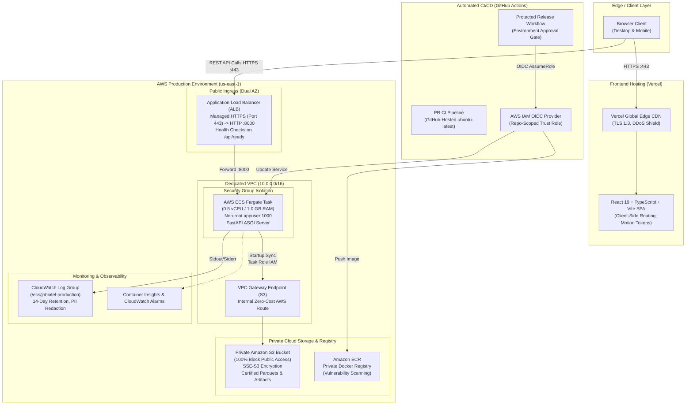
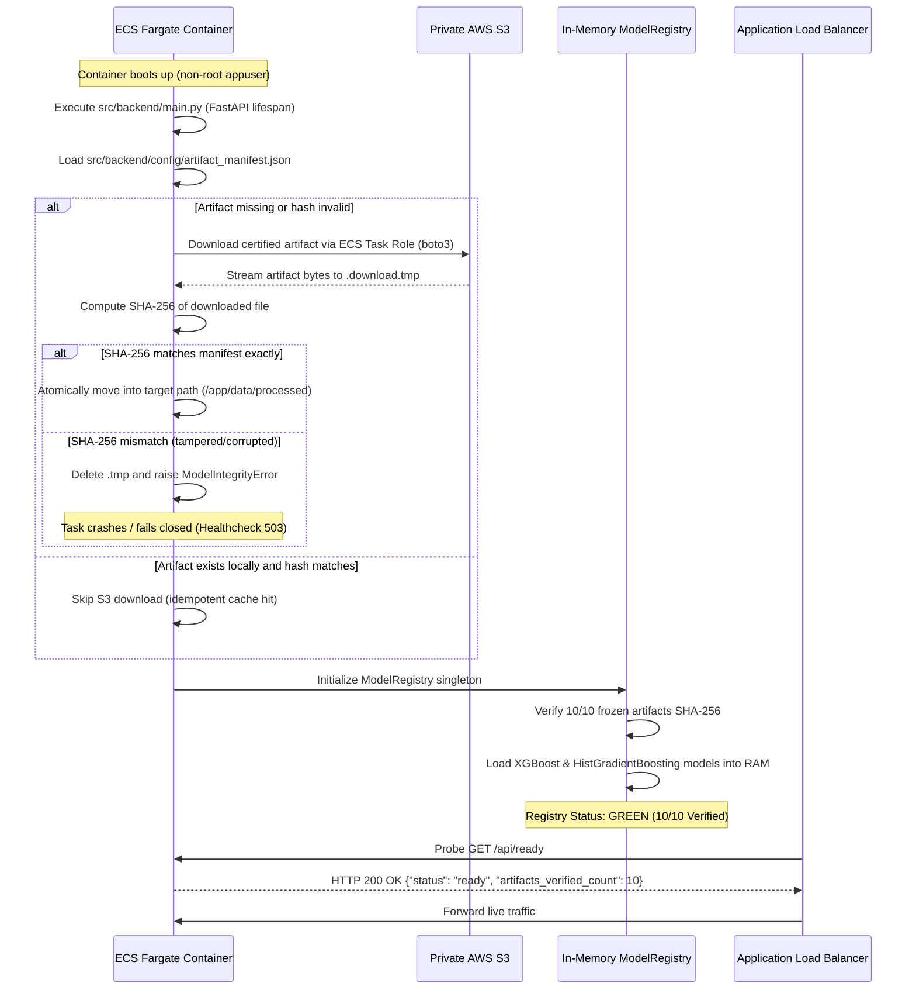

# Cloud Architecture Specification — Job Market Intelligence

**Platform:** Job Market Intelligence (JobIntel)  
**Document:** `docs/deployment/cloud-architecture.md`  
**Version:** 2.0.0 (Cloud Native)  
**Status:** Approved Target Architecture  

---

## 1. High-Level Architectural Topology

The Job Market Intelligence platform is architected as an independently scalable, decoupled, serverless cloud application. The frontend Single Page Application (SPA) and backend REST API are separated across modern cloud platforms to eliminate any dependency on personal local workstations, local filesystems, Docker Desktop, or self-hosted GitHub Actions runners.

---

## 2. Component Specifications

### 2.1 Frontend: React 19 + Vite + TypeScript (Vercel)
- **Role:** Delivers the interactive user interface, exploration dashboards, cross-market comparisons, and real-time salary estimator.
- **Hosting:** Vercel Global Edge Network with automatic Brotli/Gzip compression and immutable asset caching.
- **Configuration:** 
  - `VITE_API_BASE_URL`: Injected during Vercel build time pointing to the deployed AWS ALB URL (e.g. `https://api.jobintel.com` or `https://<alb-dns-name>`).
  - Client-side routing: Handled via `frontend/vercel.json` rewrites to prevent 404s on browser refresh.
- **Security:** Zero cloud credentials or private datasets are ever exposed to the client bundle.

### 2.2 Ingress: Application Load Balancer (AWS ALB)
- **Role:** High-availability reverse proxy and HTTPS termination.
- **Placement:** Spans 2 Availability Zones (`us-east-1a`, `us-east-1b`) in public subnets.
- **Health Monitoring:** Probes `/api/ready` every 30 seconds. Returns healthy only when all 10 frozen artifacts have been cryptographically verified.
- **TLS Policy:** `ELBSecurityPolicy-TLS13-1-2-2021-06` enforcing modern TLS 1.2 and TLS 1.3 ciphers.

### 2.3 Backend Compute: AWS ECS Fargate
- **Role:** Runs the containerized FastAPI production application (`src.backend.main:app`).
- **Resource Sizing:** 0.5 vCPU (512 CPU units), 1.0 GB RAM (1024 MB).
- **Execution Security:** Runs as non-root user `appuser` (UID 1000).
- **Network Security:** Task security group restricts inbound traffic strictly to the ALB security group on port 8000. No direct internet ingress is permitted.
- **Concurrency & Workers:** Uvicorn single/dual worker model with asyncio event loop. Singleton `ModelRegistry` ensures in-memory ML models are shared without duplicate allocations.

### 2.4 Cloud Storage: Private Amazon S3 Bucket
- **Role:** Serves as the authoritative, tamper-proof repository for frozen model files and certified runtime Parquet datasets (`modeling_dataset.parquet`, `india_modeling_cohort.parquet`, `skill_matrix_technical.parquet`, etc.).
- **Security:**
  - **100% Block Public Access** enabled across all 4 AWS controls.
  - Encryption at rest via AES256 (SSE-S3).
  - Bucket policy strictly denies unencrypted transport (`aws:SecureTransport = "false"`).
  - Access is granted exclusively to the ECS Task Role via least-privilege IAM policy.

---

## 3. Dual-Market Isolation Contract

A core scientific requirement of the Job Market Intelligence system is the absolute isolation of the USA and India analytical pipelines:

| Dimension | USA Pipeline | India Pipeline |
|---|---|---|
| **Cohort Size** | 34,036 tech postings | 5,859 tech postings |
| **Model Algorithm** | Tuned XGBoost Regressor | HistGradientBoostingRegressor |
| **Feature Dimension** | **Exactly 123 features** | **Exactly 290 features** |
| **Target Currency** | Native **USD ($)** Annual Salary | Native **INR (₹)** / LPA Midpoint |
| **Exchange Rate Conversion** | **ZERO (Forbidden)** | **ZERO (Forbidden)** |
| **Discovered Archetypes** | 7 Distinct Archetypes (k=7) | 6 Distinct Archetypes (k=6) |
| **Holdout Evaluation MAE** | $36,380.64 | ₹3.71 LPA (₹371,472) |

---

## 4. Cold Startup & Dynamic Synchronization Sequence

When an ECS task starts up on Fargate, the following sequence occurs before taking traffic:

