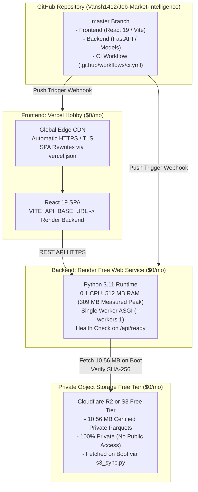

# Free 24/7 Cloud Deployment Guide — Vercel + Render ($0/Month)

**Platform:** Job Market Intelligence (JobIntel)  
**Target Monthly Cost:** **$0.00 / Month** (Genuinely Free Tier)  
**Architecture:** Vercel Hobby (Frontend) + Render Free Web Service (Backend) + Cloudflare R2 / S3 Free (Private Datasets)  
**Document ID:** `DOC-FREE-DEPLOY-2026-01`  

---

## 1. Architecture Overview

This deployment architecture provides 24/7 cloud accessibility with automatic GitHub push-to-deploy, zero local machine dependencies, and zero monthly hosting charges:



---

## 2. Technical Feasibility & Resource Measurements

Before configuring Render Free, the application's actual resource consumption was empirically measured:

| Metric | Measured Value | Render Free Limit | Headroom / Margin |
|---|---|---|---|
| **Base Process RSS** | 18.64 MB | 512 MB | +493 MB |
| **ModelRegistry In-Memory RSS** | 269.62 MB | 512 MB | +242 MB |
| **DataService Cached RSS** | 270.48 MB | 512 MB | +241 MB |
| **Peak Analytical Runtime RSS** | **309.80 MB** | **512 MB** | **+202 MB (40% Safety Margin)** |
| **Private Dataset Storage** | **10.56 MB** | R2: 10,000 MB (10 GB) | >99.9% Free Capacity |
| **Monthly Free Hours** | 730 hrs (24/7) | 750 free hrs/month | Full Month Coverage |

> [!IMPORTANT]
> **CRITICAL Uvicorn Sizing Rule:** The start command MUST use `--workers 1`. Running multiple worker processes would duplicate the ~310 MB memory footprint into 620 MB, exceeding Render's 512 MB cgroup limit and triggering an out-of-memory (OOM) termination. A single async worker handles hundreds of concurrent requests efficiently via Python's `asyncio` event loop.

---

## 3. Step 1: Deploy Frontend on Vercel Hobby

1. Log in to [Vercel](https://vercel.com) using your GitHub account.
2. Click **Add New...** > **Project**.
3. Select your repository: `Vansh1412/Job-Market-Intelligence`.
4. Configure Project Settings:
   - **Framework Preset:** `Vite`
   - **Root Directory:** Click Edit and select `frontend`
   - **Build Command:** `npm run build` (Default)
   - **Output Directory:** `dist` (Default)
5. **Environment Variables:**
   - Add: `VITE_API_BASE_URL`
   - Value: `https://<your-render-service-name>.onrender.com` (You can update this after Step 2).
6. Click **Deploy**.
7. Vercel will build and publish your frontend at `https://job-market-intelligence.vercel.app` (or your chosen project name).
8. Every future `git push origin master` will automatically build and deploy the frontend in ~45 seconds.

---

## 4. Step 2: Deploy Backend on Render Free

1. Log in to [Render](https://render.com) using your GitHub account.
2. Click **New +** > **Web Service**.
3. Connect your repository: `Vansh1412/Job-Market-Intelligence`.
4. Configure Web Service Parameters:
   - **Name:** `jobintel-backend` (or your preferred name)
   - **Region:** `Oregon (US West)` or `Ohio (US East)`
   - **Branch:** `master`
   - **Runtime:** `Python 3`
   - **Build Command:** `pip install --upgrade pip && pip install -r requirements.txt`
   - **Start Command:** `uvicorn src.backend.main:app --host 0.0.0.0 --port $PORT --workers 1`
   - **Instance Type:** Select **Free** (0.1 CPU, 512 MB RAM, $0/month).
5. Under **Advanced** > **Health Check Path**:
   - Set to `/api/ready`.
6. Under **Environment Variables**, add:
   - `PYTHON_VERSION`: `3.11.9`
   - `JOBINTEL_ENV`: `production`
   - `CORS_ORIGINS`: `https://<your-vercel-domain>.vercel.app,http://localhost:5173`
   - `S3_BUCKET_NAME`: `<your-private-bucket-name>`
   - `S3_ENDPOINT_URL`: (Optional, only needed if using Cloudflare R2, e.g. `https://<account_id>.r2.cloudflarestorage.com`)
   - `AWS_ACCESS_KEY_ID`: `<your-access-key-id>`
   - `AWS_SECRET_ACCESS_KEY`: `<your-secret-access-key>`
   - `AWS_REGION`: `auto` (or `us-east-1`)
7. Click **Create Web Service**.
8. Render will clone the repository, install Python dependencies, start the ASGI server, and expose your public API URL at `https://jobintel-backend.onrender.com`.

---

## 5. Step 3: Private Storage Setup for Datasets ($0/Month)

The 5 certified private runtime datasets (`modeling_dataset.parquet`, `india_modeling_cohort.parquet`, `skill_matrix_technical.parquet`, `job_archetype_assignments.parquet`, and `india_skill_analytics.json`) total **10.56 MB** and must remain out of public GitHub.

### Option A: Cloudflare R2 (Recommended — 100% Free Forever)
- **Free Allowance:** 10 GB storage free forever, 10M read operations/month free, **$0 egress fees**.
1. Log in to the Cloudflare dashboard > **R2**.
2. Click **Create Bucket** > name it `jobintel-private-data`. Ensure public access remains disabled.
3. In **R2 Manage API Tokens**, create a token with `Object Read & Write` permissions.
4. Upload the 5 files to the bucket under `data/processed/`:
   ```bash
   aws s3 cp data/processed/modeling_dataset.parquet "s3://jobintel-private-data/data/processed/modeling_dataset.parquet" --endpoint-url "https://<account-id>.r2.cloudflarestorage.com"
   aws s3 cp data/processed/india/india_modeling_cohort.parquet "s3://jobintel-private-data/data/processed/india/india_modeling_cohort.parquet" --endpoint-url "https://<account-id>.r2.cloudflarestorage.com"
   aws s3 cp data/processed/skill_matrix_technical.parquet "s3://jobintel-private-data/data/processed/skill_matrix_technical.parquet" --endpoint-url "https://<account-id>.r2.cloudflarestorage.com"
   aws s3 cp data/processed/job_archetype_assignments.parquet "s3://jobintel-private-data/data/processed/job_archetype_assignments.parquet" --endpoint-url "https://<account-id>.r2.cloudflarestorage.com"
   aws s3 cp data/processed/india/india_skill_analytics.json "s3://jobintel-private-data/data/processed/india/india_skill_analytics.json" --endpoint-url "https://<account-id>.r2.cloudflarestorage.com"
   ```
5. Enter the R2 Endpoint URL, Bucket Name, and Access Keys in your Render Web Service Environment Variables.

### Option B: AWS S3 Free Tier
- **Free Allowance:** 5 GB standard storage, 20,000 GET requests/month.
- Same upload steps using standard AWS CLI without `--endpoint-url`.

---

## 6. Cold Start Characteristics & Free-Tier Limitations

| Characteristic | Behavior | Mitigation |
|---|---|---|
| **Inactivity Spin-Down** | Render Free instances spin down after 15 minutes of inactivity. | Expected behavior on free tier. The first request takes ~50 seconds to wake up the server. |
| **Startup S3 Download** | On cold boot, `s3_sync.py` downloads the 10.56 MB datasets and validates SHA-256. | Takes < 1.5 seconds over cloud network. Fast and deterministic. |
| **Subsequent Requests** | Once awake, the server responds in **sub-100ms** for live predictions and market queries. | Smooth and fast for active user sessions. |
| **Memory Limit** | 512 MB hard ceiling. | Single worker ASGI (`--workers 1`) holds memory at **~310 MB**, ensuring 202 MB buffer. |
| **Total Monthly Cost** | **$0.00 / month** | Guaranteed $0 with zero paid addons or accidental billings. |
