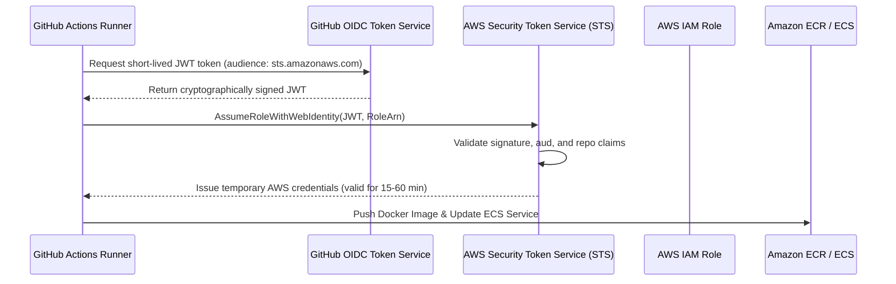

# GitHub Actions AWS OIDC Configuration Guide

**Platform:** Job Market Intelligence (JobIntel)  
**Document:** `docs/deployment/github-oidc.md`  
**Security Standard:** Zero Long-Lived Credentials, Least-Privilege IAM  

---

## 1. Overview of GitHub OIDC Authentication

Rather than storing permanent `AWS_ACCESS_KEY_ID` and `AWS_SECRET_ACCESS_KEY` credentials in GitHub Secrets—which introduce severe credential-leakage risks and require manual rotation—this deployment architecture authenticates GitHub Actions via **OpenID Connect (OIDC)**.



---

## 2. AWS IAM Trust Policy Specification

The IAM deployment role (`jobintel-github-deploy-role-production`) is governed by an exact trust policy restricting assumption to this repository:

```json
{
  "Version": "2012-10-17",
  "Statement": [
    {
      "Effect": "Allow",
      "Principal": {
        "Federated": "arn:aws:iam::<ACCOUNT_ID>:oidc-provider/token.actions.githubusercontent.com"
      },
      "Action": "sts:AssumeRoleWithWebIdentity",
      "Condition": {
        "StringEquals": {
          "token.actions.githubusercontent.com:aud": "sts.amazonaws.com"
        },
        "StringLike": {
          "token.actions.githubusercontent.com:sub": [
            "repo:Vansh1412/Job-Market-Intelligence:environment:production",
            "repo:Vansh1412/Job-Market-Intelligence:ref:refs/heads/master"
          ]
        }
      }
    }
  ]
}
```

### Security Benefits
- **Untrusted PR Protection:** Pull requests from forks or untrusted branches cannot assume the role.
- **Short-Lived:** Credentials expire automatically after the workflow run completes.
- **Auditability:** AWS CloudTrail logs every role assumption with the exact GitHub workflow run ID and actor.

---

## 3. GitHub Repository Configuration

To connect GitHub Actions to the provisioned AWS IAM role, configure the following non-secret repository variables in GitHub (**Settings** > **Secrets and variables** > **Actions** > **Variables**):

| Variable Name | Description | Example Value |
|---|---|---|
| `AWS_DEPLOY_ROLE_ARN` | The ARN of the Terraform-generated IAM deploy role | `arn:aws:iam::123456789012:role/jobintel-github-deploy-role-production` |
| `AWS_REGION` | Target AWS deployment region | `us-east-1` |
| `ECR_REPOSITORY` | Name of the Amazon ECR repository | `jobintel-backend` |
| `ECS_CLUSTER_NAME` | Name of the ECS cluster | `jobintel-cluster-production` |
| `ECS_SERVICE_NAME` | Name of the ECS service | `jobintel-service-production` |
| `API_ENDPOINT_URL` | Public HTTPS or HTTP endpoint for live smoke tests | `https://api.jobintel.com` or `http://<alb-dns>` |

> [!NOTE]
> None of these variables contain private keys or secrets. They are standard resource identifiers.

---

## 4. Protected GitHub Environment Setup

To ensure no code is pushed to production without human verification:

1. In your GitHub repository, navigate to **Settings** > **Environments**.
2. Click **New environment** and enter name: `production`.
3. Under **Deployment protection rules**, enable **Required reviewers**.
4. Add your GitHub username as an authorized approver.
5. Under **Deployment branches**, select **Selected branches** and add `master`.
6. Save rules.

Now, whenever `.github/workflows/deploy-aws.yml` is dispatched, GitHub Actions will pause and wait for your manual approval before assuming the AWS role or deploying to ECS.
