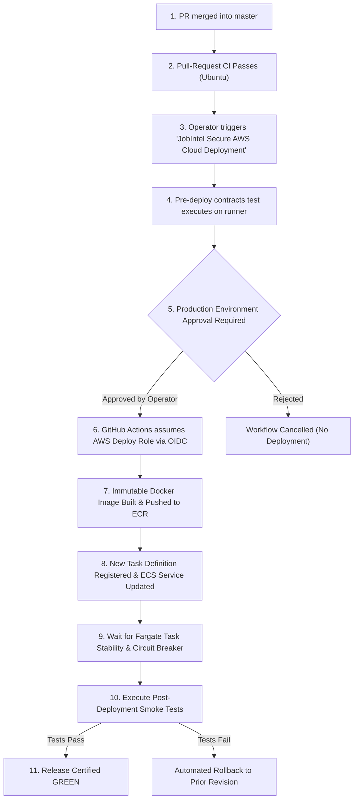

# Production Release Runbook — Job Market Intelligence

**Platform:** Job Market Intelligence (JobIntel)  
**Document:** `docs/deployment/release-runbook.md`  
**Execution Type:** Protected, Manual Dispatch with Approval Gate  

---

## 1. Pre-Release Checklist

Before initiating any release to production:
- [ ] Working tree is clean on `master` with all tests passing locally.
- [ ] Pull-request CI (`.github/workflows/ci.yml`) is GREEN on GitHub.
- [ ] No private datasets or credentials are committed in git history.
- [ ] All 10 frozen artifact SHA-256 signatures are bitwise verified.
- [ ] `src/backend/config/artifact_manifest.json` matches current release state.

---

## 2. Release Execution Workflow



---

## 3. Step-by-Step Operator Instructions

### Step 3.1: Trigger Workflow
1. Navigate to the GitHub repository > **Actions**.
2. Select **JobIntel Secure AWS Cloud Deployment** from the left-hand menu.
3. Click **Run workflow**.
4. Select branch: `master`.
5. Select target environment: `production`.
6. Click **Run workflow**.

### Step 3.2: Review & Approve Deployment
1. Open the running workflow.
2. The `deploy-to-ecs` job will pause with a prompt: **"Waiting for review"**.
3. Click **Review deployments**.
4. Verify the commit SHA matches the approved merge.
5. Check the `production` environment box and click **Approve and deploy**.

### Step 3.3: Automated Deployment & Validation
The workflow will autonomously:
1. Exchange GitHub OIDC token for temporary AWS deployment credentials.
2. Log in to Amazon ECR.
3. Build the production multi-stage container image tagged with the commit SHA (`jobintel-backend:<sha>`).
4. Push the image to private Amazon ECR.
5. Register a new revision of the ECS task definition.
6. Update the ECS service with the new task definition.
7. Monitor deployment health until all Fargate tasks report healthy.
8. Execute live smoke tests against the public `/api/ready`, `/api/usa/predict`, and `/api/india/predict` endpoints.

---

## 4. Post-Deployment Verification Checklist

Verify the deployed endpoints return expected results:

```bash
$API_URL = "https://your-api-domain.com"

# 1. Readiness Check (must return 200 and 10/10 verified)
curl -i "$API_URL/api/ready"

# 2. USA Prediction Verification (exactly 123 features processed)
curl -s -X POST "$API_URL/api/usa/predict" \
  -H "Content-Type: application/json" \
  -d '{"role_family":"ML / AI Engineer","seniority":"Senior","city_clean":"San Francisco","is_remote":true,"selected_skills":["skill_python","skill_pytorch"]}'

# 3. India Prediction Verification (exactly 290 features processed)
curl -s -X POST "$API_URL/api/india/predict" \
  -H "Content-Type: application/json" \
  -d '{"normalized_role":"Data Engineer","experience_midpoint_years":5.0,"experience_range_years":2.0,"city_grouped":"Bengaluru","work_mode":"Hybrid","selected_skills":["skill_spark","skill_python"]}'

# 4. Frontend Health
# Open https://jobintel.vercel.app in a browser; verify Salary Predictor and Market Explorer render live data.
```
