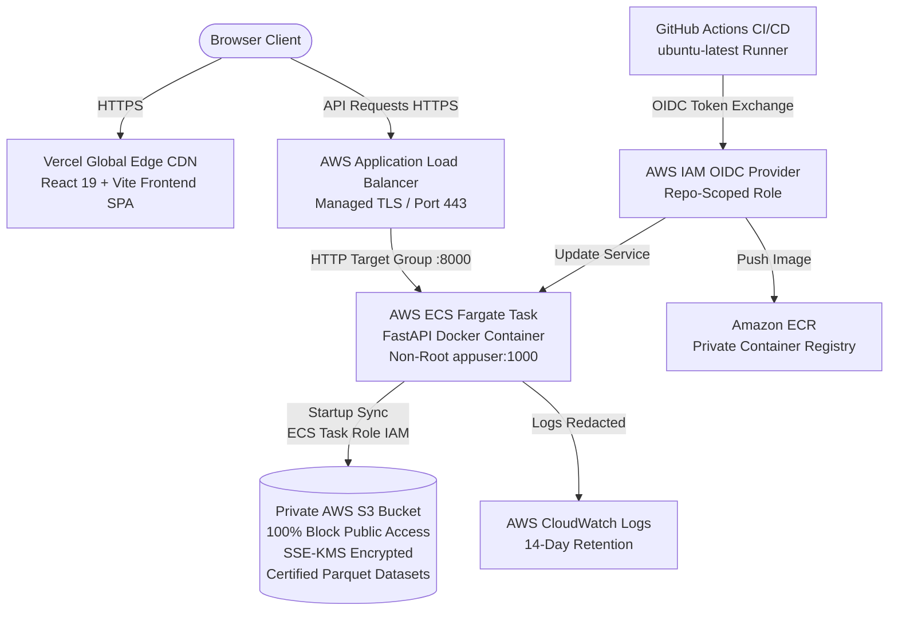

# Job Market Intelligence: Cloud Migration Forensic Audit & Target Architecture Plan

**Document ID:** `AUDIT-JOBINTEL-2026-CLOUD-01`  
**Date:** October 2026  
**Auditor:** Antigravity Cloud Architecture & MLOps Team  
**Repository:** `Vansh1412/Job-Market-Intelligence`  
**Git Branch:** `master`  
**Status:** Certified Forensic Audit (Phase 0 Complete)  

---

## 1. Executive Summary

This forensic audit evaluates the Job Market Intelligence platform (`Vansh1412/Job-Market-Intelligence`) for a secure, 24/7 cloud migration. The project is a scientifically validated machine learning application predicting tech salaries and discovering job archetypes across dual independent labor markets:
- **USA Market:** 34,036 tech postings, 123 features, XGBoost Regressor ($ USD), 7 discovered archetypes.
- **India Market:** 5,859 tech postings, 290 features, HistGradientBoostingRegressor (₹ INR / LPA), 6 discovered archetypes.

### Primary Objective
Transition the application from a local workstation-dependent setup (requiring a Windows PC, local drive `E:\Job Market`, Docker Desktop, and a self-hosted GitHub Actions runner) to an autonomous, enterprise-grade cloud architecture operating 24/7 with zero local dependencies, while strictly maintaining all scientific reproducibility contracts, zero-retraining mandates, dual-market currency isolation, and data governance policies.

---

## 2. Current Architecture Forensic Findings

### 2.1 Entry Points and Runtimes
| Component | Implementation | Entrypoint | Runtime Environment |
|---|---|---|---|
| **Frontend** | React 19 + TypeScript + Vite + Tailwind/Lucide/Recharts | `frontend/src/main.tsx` | Node 20 / Browser SPA |
| **Backend** | FastAPI + Uvicorn + Pydantic v2 | `src/backend/main.py:app` | Python 3.11/3.13 ASGI |
| **Model Registry** | Singleton Cryptographic Hash Verifier | `src/backend/models/model_registry.py` | In-memory + Local disk |
| **Container Engine** | Multi-Stage Dockerfile | `Dockerfile` (Node 20 -> Python 3.11-slim) | Linux container (non-root `appuser:1000`) |

### 2.2 Health & Readiness Probes
The backend exposes explicit, standards-compliant probes:
- `GET /health` and `GET /api/health`: Liveness probe. Returns HTTP 200 with status `"healthy"` or `"degraded"` and registry verification status.
- `GET /ready` and `GET /api/ready`: Readiness probe. Returns HTTP 200 only when all 10 certified frozen artifacts are verified (`artifacts_verified_count == 10` and `status == "GREEN"`). Returns HTTP 503 (`Service Unavailable`) if any artifact is missing or altered.
- `GET /api/meta`: Returns immutable cohort research metadata, sample sizes, and model parameters.

### 2.3 Local Environment Coupling
1. **Host-Side Data Volume Mount:** The local Docker container was executed with `-v "${env:HOST_DATA_PATH}:/app/data/processed:ro"`. In ECS Fargate, local host bind mounts do not exist.
2. **GitHub Actions Runner:** The release gate (`.github/workflows/docker-release-gate.yml`) runs on `[self-hosted, Windows, X64, jobintel-private-data]`.
3. **Frontend API URL:** `frontend/src/services/api.ts` line 22 hardcodes `const API_BASE = '/api';`. While functional behind a reverse proxy or local Vite proxy (`http://127.0.0.1:8000`), independent deployment to Vercel requires configuring `import.meta.env.VITE_API_BASE_URL`.
4. **Backend Path Handling:** All backend paths in `src/backend/` use standard relative paths (`data/processed/...`, `models/...`, `reports/...`). Zero hardcoded Windows drives (`E:\` or `C:\`) exist in runtime backend code.

---

## 3. Frozen Artifact & Runtime Data Inventory

### 3.1 Ten Certified Frozen Artifacts (Integrity Contract)
Every artifact has been verified bitwise intact against the repository's authoritative checksums:

| Artifact Key | Path | Size | Certified SHA-256 | Tracked in Git? | Verification |
|---|---|---|---|:---:|:---:|
| `india_salary_model` | `models/india/final_model.pkl` | 647 KB | `7a3490d7a36a128eea5a70e80bb3550c504da69648ac368a891f8729282a8310` | Yes | **PASS (Match)** |
| `india_preprocessor` | `models/india/final_preprocessor.pkl` | 2.5 KB | `0ee1dabf3130a19c8bbc80a31ab93d8e97affa4d4a688249d59ee336f7ab4ead` | Yes | **PASS (Match)** |
| `india_cohort` | `data/processed/india/india_modeling_cohort.parquet` | 654 KB | `d4e32be45d84b159804e1a019f44dd5da6682346e38f39635e8edcaac3a200ec` | **No (Private)** | **PASS (Match)** |
| `india_pca` | `models/india/india_pca_v1.pkl` | 34 KB | `8591e3d3f713e35b27307e0c5810b35bb80ee33fd97bc909487985624e390897` | Yes | **PASS (Match)** |
| `india_kmeans` | `models/india/india_kmeans_v1.pkl` | 2.8 KB | `4465a3d8c3b7ab92e668cab2b502bdc3ba832d8458545f00cc5121d9c73da40a` | Yes | **PASS (Match)** |
| `usa_salary_model` | `models/phase5/best_model.pkl` | 2.5 MB | `55c1b7fd87d2a04c9761a1941fcc4f6d3174ed80a10ce0802b0c07fc644bfadd` | Yes | **PASS (Match)** |
| `usa_preprocessor` | `models/phase5/best_pipeline.pkl` | 8.2 KB | `815fd9a3d88f2ebae82cebce86c6438d0455835de8de1bb8d66802f12a77be19` | Yes | **PASS (Match)** |
| `usa_scaler` | `models/scaler_phase4_1.pkl` | 1.8 KB | `2d969acd5b175979ac65a9ae5bf94f73ddd1bb7e3618528ab76706f16b00577c` | Yes | **PASS (Match)** |
| `usa_pca` | `models/pca_phase4_1.pkl` | 11 KB | `ef4ef56bdc4b9471b1ec636fb9c689744832992b13f9733549271a19e3ce83c0` | Yes | **PASS (Match)** |
| `usa_kmeans` | `models/kmeans_phase4_1_k7.pkl` | 2.4 KB | `4d6d2509f04502fdf088604151b66d2272a8b4de106ce9fa2f745f97806c0106` | Yes | **PASS (Match)** |

*Registry Status:* **GREEN (10/10 Verified)**.

### 3.2 Private Runtime Data Contract
In addition to the models, certain API endpoints compute dynamic distributions and empirical analytics from processed Parquet datasets and JSON files:

| Runtime File | Target Relative Path | File Size | SHA-256 Checksum | Dependent API Endpoints |
|---|---|---|---|---|
| `india_modeling_cohort.parquet` | `data/processed/india/india_modeling_cohort.parquet` | 654,351 B | `d4e32be45d84b159804e1a019f44dd5da6682346e38f39635e8edcaac3a200ec` | Readiness probe, India Market Summary, Cross-Market Summary |
| `modeling_dataset.parquet` | `data/processed/modeling_dataset.parquet` | 1,669,405 B | `68895e3823cca91ffbfea76b8986198700b4eb8bb02905bacc9a04985156a21b` | USA Market Summary, Cross-Market Summary, Skills Frequency, Salary Association |
| `skill_matrix_technical.parquet` | `data/processed/skill_matrix_technical.parquet` | 5,334,250 B | `91abf1d836de7e50e5bcdc64aa68dfcba0850af0550ce53f907ef547f391b406` | Skills Corpus Frequency, Archetype Skill Lift |
| `job_archetype_assignments.parquet` | `data/processed/job_archetype_assignments.parquet` | 2,725,548 B | `c4f2fb9353837087d198bb936c469875aab84361ecbce69bed4d3c19b639147c` | Archetype Cluster Sizes, Archetype Profiles |
| `india_skill_analytics.json` | `data/processed/india/india_skill_analytics.json` | 180,164 B | `805e33aeca78dfa7ce0c6da2ec2b04654e91c053ccaffd9e2219ca0c9c0378c5` | India Skills Analytics, Skill Detail Endpoint |

**Total Size of Private Runtime Data Assets:** **10.56 MB**.

---

## 4. Security & Data Governance Findings

1. **Private Data Exposure Risk:** None detected. `.gitignore` and `.dockerignore` strictly ignore `*.parquet`, `*.csv`, `data/raw/`, `data/processed/`, `.env`, and secret keys. No raw ATS records or private dataset files have been committed to Git.
2. **Container Credentials:** The Dockerfile and application do not embed AWS credentials, API keys, or database secrets.
3. **CORS Governance:** The backend reads `CORS_ORIGINS` from environment variables. In cloud production, this must be restricted to the exact Vercel frontend URL (and localhost for local dev).
4. **Least-Privilege Cloud Storage:** S3 bucket must have Block Public Access 100% enabled. No presigned URLs or public ACLs. Access must be granted exclusively to the ECS Task Role via IAM policy targeting the specific bucket prefix.
5. **Short-Lived CI/CD Credentials:** GitHub Actions must authenticate to AWS via GitHub OIDC (`AssumeRoleWithWebIdentity`), removing the need for long-lived `AWS_ACCESS_KEY_ID` or `AWS_SECRET_ACCESS_KEY` in GitHub Secrets.

---

## 5. Cloud Migration Blockers & Proposed Solutions

| Blocker | Description | Resolution Strategy |
|---|---|---|
| **B1: Ephemeral Container File System** | ECS Fargate containers lack access to host machine drives (`E:\Job Market`). | Implement an idempotent cloud startup initialization module (`src/backend/utils/s3_sync.py`) executed before `ModelRegistry` warms up. Downloads certified private datasets from private S3 into container ephemeral storage `/app/data/processed` and verifies SHA-256 hashes against an embedded manifest. |
| **B2: Frontend API Base URL** | `api.ts` hardcodes `API_BASE = '/api'`. | Update `api.ts` to use `import.meta.env.VITE_API_BASE_URL || '/api'`. On Vercel, set `VITE_API_BASE_URL=https://<api-domain>`. |
| **B3: Self-Hosted CI Dependency** | Release workflow requires a Windows self-hosted runner. | Separate CI into: (1) Standard pull-request CI on GitHub-hosted `ubuntu-latest` runners (code quality, frontend build/test, non-private backend contract tests); (2) Protected cloud deployment workflow (`deploy-aws.yml`) on `ubuntu-latest` gated by protected GitHub Environment approval and AWS OIDC. |
| **B4: Missing Cloud Infrastructure Code** | No Terraform configurations currently exist. | Prepare modular Terraform code in `terraform/` defining S3 (private, encrypted), ECR repository, ECS Fargate cluster/service/task, Application Load Balancer with HTTPS, IAM roles (OIDC + ECS Task Role), and CloudWatch log groups. |

---

## 6. Proposed Target Architecture

---

## 7. AWS Cost Categories & Sizing Estimates

Based on official AWS US East (N. Virginia `us-east-1`) pricing for continuous 24/7 availability:

| Resource | Sizing / Allocation | Pricing Basis | Estimated Monthly Cost |
|---|---|---|---|
| **ECS Fargate Compute** | 1 Task: 0.5 vCPU, 1.0 GB RAM (24/7) | $0.04048/vCPU-hr + $0.004445/GB-hr | **$18.15** |
| **Application Load Balancer** | 1 ALB (24/7 active) + ~1 LCU | $0.0225/ALB-hr + $0.008/LCU-hr | **$16.43 - $22.25** |
| **Amazon S3 Storage** | ~20 MB storage + ~1,000 GETs/mo | $0.023/GB-mo + $0.0004/10k GETs | **$0.01** |
| **Amazon ECR Storage** | 1 Image (~600 MB compressed) | $0.10/GB-mo | **$0.06** |
| **AWS CloudWatch Logs** | ~2 GB ingestion/mo, 14-day retention | $0.50/GB ingested | **$1.00** |
| **AWS Data Transfer Out** | ~5 GB/mo | $0.09/GB (first 100 GB/mo free) | **$0.00** |
| **Vercel Frontend** | Hobby Tier (Custom Domain, Global CDN) | Free Tier eligible | **$0.00** |
| **TOTAL ESTIMATED MONTHLY COST** | | | **~$35.65 – $41.50 / month** |

*Cost Management Guardrail:* Set up AWS CloudWatch Billing Alarm & AWS Budgets threshold at **$45.00/month** with automated email notifications.

---

## 8. Staged Execution Plan

1. **Phase 1: Frontend Decoupling & API Base Configuration**  
   Configure `frontend/src/services/api.ts` to support `VITE_API_BASE_URL`. Verify build and tests.
2. **Phase 2: Cloud Runtime S3 Ingestion & Verification Hook**  
   Build `src/backend/utils/s3_sync.py` with automatic S3 artifact downloading, SHA-256 verification against certified manifest, and fail-closed semantics.
3. **Phase 3: Infrastructure-as-Code (Terraform)**  
   Create complete Terraform configuration (`terraform/`) for S3, ECR, ECS Fargate, ALB, IAM OIDC, and CloudWatch.
4. **Phase 4: GitHub Actions Workflows**  
   Create public-safe `.github/workflows/ci.yml` and protected `.github/workflows/deploy-aws.yml`.
5. **Phase 5: Cloud Deployment Runbooks & Cost Documentation**  
   Document setup, secrets, rollback procedures, and cost controls in `docs/deployment/`.
6. **Phase 6: Verification & User Approval Gate**  
   Halt before cloud provisioning; request explicit user sign-off.
